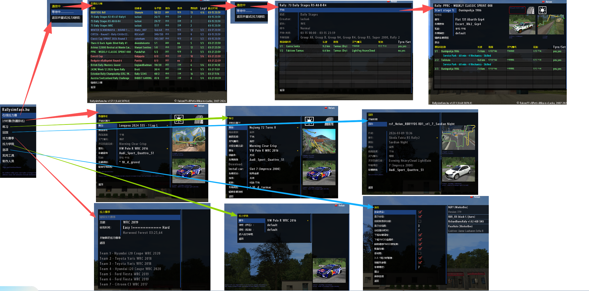

[English](README.md) | [中文](README_zh.md) | [繁體中文](README_zh-Hant.md) | [Português](README_pt.md) | **Suomi** | [Русский](README_ru.md) | [日本語](README_jp.md)

# RBRi18n

Kevyt kansainvälistämis- (i18n) lisäosa **Richard Burns Rallyyn (RBR)**. Se kaappaa pelin tekstinpiirron ladatakseen käännöksiä ja piirtääkseen CJK-fontteja oikealla skaalauksella.



## Ominaisuudet

- Monikielituki `Language=zh|en` -asetuksella
- Automaattinen päivitys: hakee uusimmat käännöstiedostot GitHubista pelin käynnistyessä
- Lisäosakohtaiset käännöstiedostot (`Translation.zh.json` jne.)
- Määritettävä fonttiperhe ja -koot
- Resoluutiotietoinen fonttiskaalaus (perustuu RBR:n alkuperäiseen 640×480-resoluutioon)
- Laajakuva-/ultralaajakuvatuki keskityksellä

## Asennus

1. Kopioi `RBRi18n.dll` RBR:n `Plugins`-hakemistoon
2. Luo `RBRi18n`-kansio RBR:n juurihakemistoon
3. Käännöstiedostot ladataan automaattisesti ensimmäisellä käynnistyskerralla

## Pika-asennus

1. Pura `RRBi18n-v1.x.x.zip`-arkisto saadaksesi kaksi kansiota: `Plugins` ja `RBRi18n`
2. Vedä molemmat kansiot sisältöineen suoraan RBR-pelin juurihakemistoon
3. Järjestelmä yhdistää automaattisesti `Plugins`-kansion; korvaa tiedostot pyydettäessä

## Määritykset

Oletuskieli on kiina. Määrittääksesi toisen kielen, lisää seuraava `RichardBurnsRally.ini`-tiedostoon pelin juurihakemistossa:

```ini
[RBRi18n]
Language=fi

; Valinnaiset fonttiasetukset (oletusarvot näytetty)
FontFamily=SimHei
FontSizeSmall=7
FontSizeBig=8
FontSizeDebug=6
FontSizeHeading=8
FontSizeMenu=8
```

## Käännöstiedostot

Käännöstiedostot käyttävät JSON-muotoa. Tiedostot nimetään `{lähde}.{kieli}.json`:
Jos sinulla on ehdotuksia tai korjauksia käännöksiin, forkkaa tämä projekti ja lähetä korjattu JSON-tiedostosi.

```
RBRi18n/
├── RichardBurnsRally.zh.json  # Peruspeli (kiina)
├── Weather.zh.json            # Sääkäännökset (kiina)
├── Options.zh.json            # Asetusvalikko (kiina)
├── TuneCar.zh.json            # Auton säätö (kiina)
└── ...
```

Esimerkki käännöstiedostosta:

```json
{
  "Options": "Asetukset",
  "Quick Rally": "Pikaralli"
}
```

Kaikki määritettyä kielipäätettä vastaavat tiedostot ladataan ja yhdistetään.

## Käännä lähdekoodista

### Edellytykset

- Windows
- Visual Studio C++-työkaluilla (v143-työkalusarja)
- Windows SDK 10.0

### Kääntäminen

1. Avaa `RBRi18n.vcxproj` Visual Studiossa (tai lisää ratkaisuun)
2. Valitse **Release | Win32**
3. Käännä

Tuloste: `Release/RBRi18n.dll`

## Kiitokset

- RBR API -muistiosoitteet ja rakenteet johdettu [MIKA-N:n RBRAPI:sta](https://github.com/mika-n) (MIT-tyyppinen lisenssi, katso `RBR/RBRAPI.h`)
- [MinHook](https://github.com/TsudaKageworthy/minhook) funktioiden kaappaukseen
- [nlohmann/json](https://github.com/nlohmann/json) JSON-jäsentämiseen

## Lisenssi

[MIT](LICENSE)
