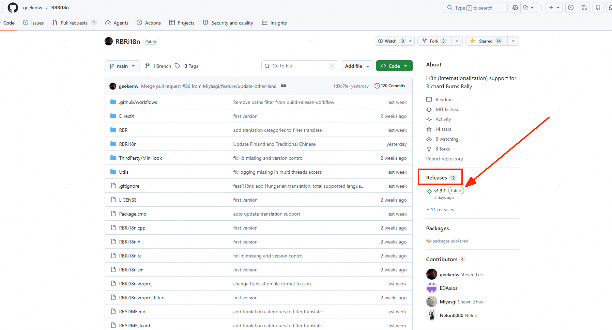
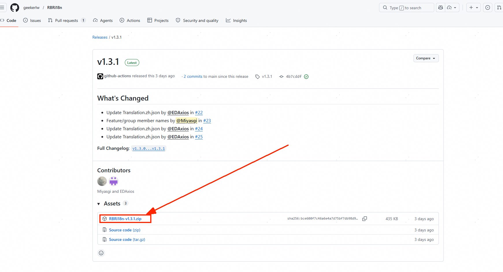
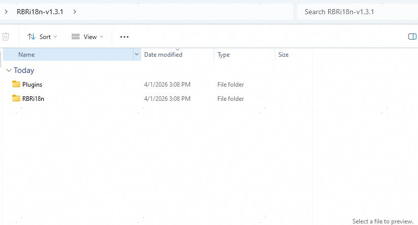
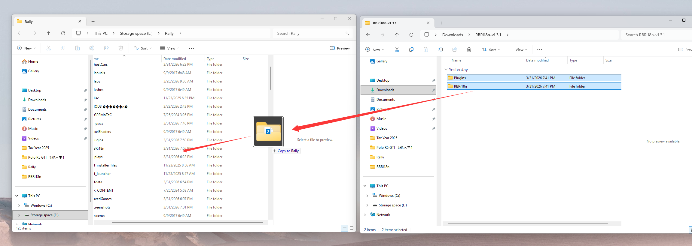
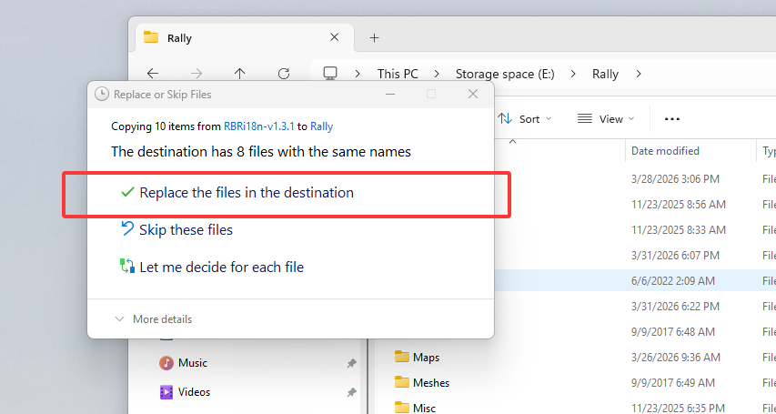

[English](README.md) | [中文](README_zh.md) | [繁體中文](README_zh-Hant.md) | [Português](README_pt.md) | [Suomi](README_fi.md) | **Русский** | [日本語](README_jp.md) | [Magyar](README_hu.md)

# RBRi18n

Легковесный плагин интернационализации (i18n) для **Richard Burns Rally (RBR)**. Он перехватывает отрисовку текста в игре для загрузки переводов и рендеринга шрифтов CJK с правильным масштабированием.


## Возможности

- Поддержка нескольких языков через настройку `Language=zh|en`
- Автоматическое обновление: загружает последние файлы перевода с GitHub при запуске игры
- Файлы перевода для каждого плагина (`Translation.zh.json` и т.д.)
- Настраиваемое семейство и размеры шрифтов
- Масштабирование шрифтов с учётом разрешения (на основе родного разрешения RBR 640×480)
- Поддержка центрирования для широкоформатных и сверхширокоформатных экранов

## Установка

1. Скопируйте `RBRi18n.dll` в каталог `Plugins` вашей установки RBR
2. Создайте папку `RBRi18n` в корневом каталоге RBR
3. Файлы перевода загружаются автоматически при первом запуске

## Быстрая установка

1. Скачайте последний zip-файл (из раздела Releases)
   
   
2. Распакуйте архив `RRBi18n-v1.x.x.zip`, чтобы получить две папки: `Plugins` и `RBRi18n`
   
3. Перетащите обе папки с их содержимым прямо в корневой каталог игры RBR
   
4. Система автоматически объединит папку `Plugins`; перезапишите файлы при запросе
 

## Настройка

Язык по умолчанию — китайский. Чтобы настроить другой язык, добавьте в файл `RichardBurnsRally.ini` в корневом каталоге игры:

```ini
[RBRi18n]
Language=ru

; Необязательные настройки шрифта (показаны значения по умолчанию)
FontFamily=Arial Unicode MS
FontSizeSmall=7
FontSizeBig=8
FontSizeDebug=6
FontSizeHeading=8
FontSizeMenu=8

; Необязательные цвета меню (hex AARRGGBB или RRGGBB, показаны значения по умолчанию)
ColorBackground=FF323232
ColorSelection=FFFF0000
ColorIcon=FFC8C8C8
ColorText=FFFFFFFF
ColorHeading=FFFFFFFF

; Отключить определённые категории перевода (через запятую)
; Доступные: cars, stages, menu, options, tuning, rally, weather, tutorial, dailystages, misc
;DisableCategories=tutorial,dailystages
```

## Файлы перевода

Файлы перевода используют формат JSON. Файлы именуются `{источник}.{язык}.json`:
Если у вас есть предложения или исправления к переводам, сделайте форк этого проекта и отправьте исправленный JSON-файл.

```
RBRi18n/
├── Translation.zh.json        # Китайский (упрощённый)
├── Translation.zh-Hant.json   # Китайский (традиционный)
├── Translation.pt.json        # Португальский
├── Translation.fi.json        # Финский
├── Translation.ru.json        # Русский
├── Translation.jp.json        # Японский
├── Translation.hu.json        # Венгерский
└── ...
```

Пример файла перевода:

```json
{
  "Options": "Настройки",
  "Quick Rally": "Быстрое ралли"
}
```

Все файлы, соответствующие настроенному языковому расширению, будут загружены и объединены.

## Сборка из исходного кода

### Предварительные требования

- Windows
- Visual Studio с инструментами C++ (набор инструментов v143)
- Windows SDK 10.0

### Сборка

1. Откройте `RBRi18n.vcxproj` в Visual Studio (или добавьте в решение)
2. Выберите **Release | Win32**
3. Соберите проект

Результат: `Release/RBRi18n.dll`

## Благодарности

- Адреса памяти и структуры RBR API взяты из [RBRAPI от MIKA-N](https://github.com/mika-n) (лицензия типа MIT, см. `RBR/RBRAPI.h`)
- [MinHook](https://github.com/TsudaKageworthy/minhook) для перехвата функций
- [nlohmann/json](https://github.com/nlohmann/json) для парсинга JSON

## Лицензия

[MIT](LICENSE)
